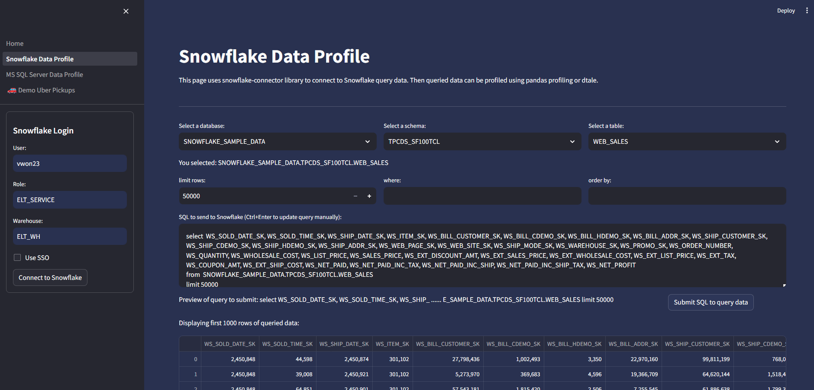
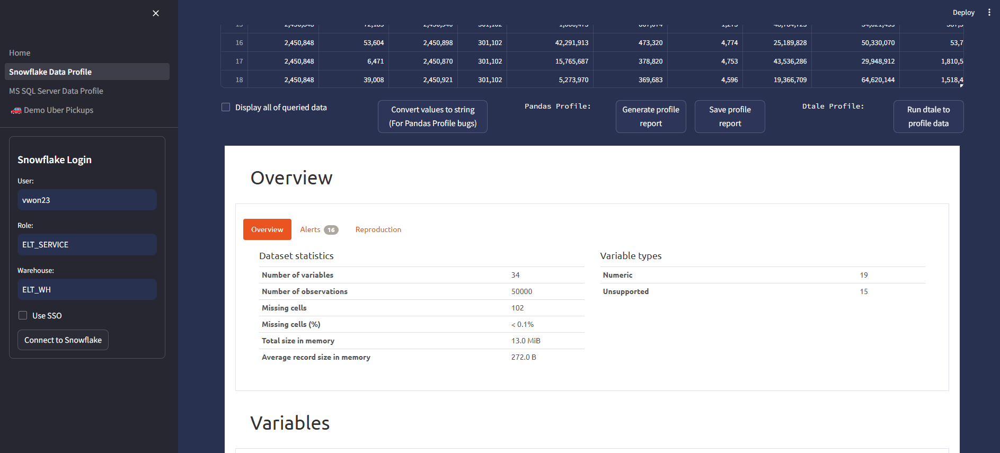

<!-- ABOUT THE PROJECT -->
## About The Project
####




This Streamlit app was devloped to easily profile data from different types of databases. This application provides options to profile data using 2 different python libraries.

Option 1: [ydata-profiling](https://github.com/ydataai/ydata-profiling)

Option 2: [dtale](https://github.com/man-group/dtale) (Credit: Andrew Schonfeld)

<!-- GETTING STARTED -->
## Getting Started

Below is instruction on how to run this streamlit application.

### Prerequisites

This application require python version > 3.7 and < 3.12. (Version 3.11 recommended)

### Installation

1. Clone the repository.
   ```sh
   git clone https://github.com/vwon23/streamlit-data-profiler
   ```

2. Install pip packages.
   ```sh
   cd streamlit-data-profiler
   pip3 install -r requirements.txt --trusted-host pypi.org --trusted-host pypi.python.org --trusted-host files.pythonhosted.org
   ```

3. Update config file `app_run/config/config.cfg` with required database connection values.
   ```sh
    [SNOWFLAKE]
    account = abc
    username = abc

    role = abc
    wh = abc

    [MSSQL]
    server = abc
    database = abc
   ```

4. Create `.env` file at parent folder of repository to store sensitive values. (Optional)
   ```sh
    snowflake_account=
    snowflake_username=
   ```
   Then update `app_run/config/config.cfg` dotenv value to true.
   ```sh
    [ENVIRON]
    run_local = true
    dotenv = true
   ```

5. Run the streamlit application.
   ```sh
   streamlit run app_run/streamlit/Home.py
   ```

Checkout https://docs.streamlit.io/ to learn more on developing Streamlit application.

If you have any questions, please feel free to reach out to vwon23@gmail.com.